# Complete Guide to Emergency Menstrual Pain Medication: Professional Solutions for Pain Relief Anywhere, Anytime

## Introduction

Menstrual pain is a common issue many women face during their periods, sometimes severely affecting daily life and work. To help you quickly relieve pain at critical moments, this guide will detail over-the-counter medication options, carrying compliance guidelines, emergency medication decision processes, and safe usage precautions. Whether you're at school, workplace, or traveling, this guide will help you prepare adequately.

> 💡 **Basic Preparation**: If you're new to menstrual pain medication, we recommend first reading our [Complete Safe Medication Guide for Dysmenorrhea](/en/downloads/medication-guide) to understand basic medication knowledge and safety precautions.

## 1. Over-the-Counter Medication Selection Guide

### 1.1 Ibuprofen-Based Medications

**Mechanism of Action**:
Ibuprofen is a nonsteroidal anti-inflammatory drug (NSAID) that reduces pain and inflammation by inhibiting prostaglandin synthesis. According to Mayo Clinic research, ibuprofen is effective for 92% of menstrual pain patients.

> 📚 **Learn More**: For detailed usage methods, dosage comparisons, and safety guidelines for ibuprofen, please refer to the professional comparison tables in our [Complete Safe Medication Guide for Dysmenorrhea](/en/downloads/medication-guide).

**Suitable Population**:
- Moderate to severe menstrual pain
- Pain accompanied by inflammation (such as endometriosis-related pain)

**Recommended Dosage**:
- Adults: 200-400mg every 4-6 hours, not exceeding 1200mg daily (follow package instructions)
- Adolescents (12+ years): Calculate by weight, typically 5-10mg/kg every 6-8 hours

**Precautions**:
- Avoid taking on empty stomach to reduce gastric discomfort
- Contraindications: Use cautiously in patients with gastric ulcers, kidney dysfunction, or asthma

**Common Brands**:
- Motrin
- Advil

### 1.2 Acetaminophen-Based Medications

**Mechanism of Action**:
Acetaminophen (such as Tylenol) primarily relieves menstrual pain by inhibiting pain signals in the central nervous system but lacks anti-inflammatory properties.

**Suitable Population**:
- Mild to moderate menstrual pain
- Those allergic to NSAIDs

**Recommended Dosage**:
- Adults: 500-1000mg every 4-6 hours, not exceeding 4000mg daily
- Adolescents: Calculate by weight, typically 10-15mg/kg every 4-6 hours

**Precautions**:
- Overdose may cause liver damage; avoid concurrent alcohol consumption
- Not suitable for long-term use

**Common Brands**:
- Tylenol
- Panadol

### 1.3 Naproxen-Based Medications

**Mechanism of Action**:
Naproxen is another NSAID with longer duration than ibuprofen, typically lasting 8-12 hours.

**Suitable Population**:
- Patients needing long-lasting menstrual pain relief
- Those with severe nighttime menstrual pain

**Recommended Dosage**:
- Adults: 220mg every 8-12 hours, not exceeding 660mg daily
- Adolescents: Use under medical guidance

**Precautions**:
- Similar contraindications to ibuprofen
- Slower onset but longer duration

**Common Brands**:
- Aleve

### 1.4 Combination Preparations

**Common Combinations**:
- Acetaminophen + Caffeine
- Ibuprofen + Caffeine

**Advantages**:
- Caffeine can enhance analgesic effects
- Suitable for menstrual pain patients with fatigue

**Precautions**:
- Avoid evening use of caffeine-containing medications
- Monitor total caffeine intake

## 2. Carrying Compliance Guidelines

### 2.1 School Carrying Regulations

**High School Level**:
- Most schools allow students to carry over-the-counter pain medications
- Recommend storing medications in original packaging with name labels
- Some schools require parental consent forms

**College Level**:
- Usually no special restrictions
- Can keep emergency medications in dormitories
- Recommend informing roommates of medication location for emergencies

### 2.2 Workplace Carrying

**Office Environment**:
- Can carry in personal drawers or bags
- Recommend preparing small pill organizers for convenience
- Pay attention to medication storage conditions (light-proof, dry)

**Special Work Environments**:
- Healthcare facilities: Follow institutional medication management regulations
- Food industry: Ensure medications are stored separately from food
- Education sector: Understand school policies regarding staff medication use

### 2.3 Travel Carrying Guidelines

**Domestic Travel**:
- Carry medications in original packaging
- Prepare medication list including generic and brand names
- Consider time zone effects on medication timing

**International Travel**:
- Understand destination country's medication entry regulations
- Prepare English medication descriptions or doctor's certificates
- Consider carrying sufficient medication quantities to avoid overseas purchase difficulties

**Air Travel Carrying**:
- Carry emergency medications in carry-on luggage, not checked baggage
- Liquid medications must comply with aviation security regulations
- Prepare prescriptions or medication descriptions for security screening

## 3. Emergency Medication Decision Process

### 3.1 Pain Assessment

**Pain Level Scoring (1-10 points)**:
- 1-3 points: Mild pain, consider non-pharmacological relief methods
- 4-6 points: Moderate pain, recommend using pain medication
- 7-10 points: Severe pain, use pain medication immediately and consider medical attention

### 3.2 Medication Selection Decision Tree

```mermaid
graph TD
    %% Node definitions
    A[🚨 Menstrual Pain Onset]:::event --> B[📊 Assess Pain Level<br/>1-10 Scale]:::judge

    B -->|1-3 points<br/>😌 Mild Pain| C[🔥 Physical Relief<br/>• Heat therapy<br/>• Rest<br/>• Light massage]:::mild

    B -->|4-6 points<br/>😣 Moderate Pain| D[💊 Choose Pain Medication<br/>• Ibuprofen 400mg<br/>• Naproxen 220mg<br/>• Acetaminophen]:::moderate

    B -->|7-10 points<br/>😰 Severe Pain| E[🚑 Immediate Action<br/>• Strong pain medication<br/>• Prepare for medical care<br/>• Contact doctor]:::severe

    D --> F[⚠️ Safety Check<br/>• Drug allergy history<br/>• Liver/kidney function<br/>• GI conditions<br/>• Pregnancy status]:::safety
    E --> F

    F --> G[📋 Take as Directed<br/>• Follow instructions<br/>• Record medication time<br/>• Avoid overdose]:::dosage

    G --> H[⏰ Observe & Wait<br/>30-60 minutes<br/>Monitor symptom changes]:::wait

    H --> I{💭 Pain Relief Achieved?}:::decision

    I -->|✅ Yes| J[📝 Continue Monitoring<br/>• Record symptoms<br/>• Watch for side effects<br/>• Maintain routine]:::success

    I -->|❌ No/Worsening| K[🏥 Seek Medical Care<br/>• Emergency department<br/>• Pain clinic<br/>• Bring medication record]:::emergency

    %% Important reminders
    L[⚠️ Important Reminders<br/>• Don't take on empty stomach<br/>• Avoid alcohol<br/>• Some drugs contraindicated in pregnancy<br/>• Persistent pain needs evaluation]:::warning

    F -.-> L
    G -.-> L

    %% Style definitions
    classDef event fill:#FF6B6B,stroke:#C92A2A,stroke-width:3px,color:#fff,font-weight:bold
    classDef judge fill:#4ECDC4,stroke:#26A69A,stroke-width:2px,color:#fff,font-weight:bold
    classDef mild fill:#51CF66,stroke:#37B24D,stroke-width:2px,color:#fff
    classDef moderate fill:#FFD43B,stroke:#FAB005,stroke-width:2px,color:#000
    classDef severe fill:#FF8787,stroke:#E03131,stroke-width:2px,color:#fff
    classDef safety fill:#DA77F2,stroke:#9C36B5,stroke-width:2px,color:#fff
    classDef dosage fill:#74C0FC,stroke:#339AF0,stroke-width:2px,color:#fff
    classDef wait fill:#FFB366,stroke:#FD7E14,stroke-width:2px,color:#fff
    classDef decision fill:#69DB7C,stroke:#51CF66,stroke-width:3px,color:#fff,font-weight:bold
    classDef success fill:#D0EBFF,stroke:#339AF0,stroke-width:2px,color:#000
    classDef emergency fill:#FFC9C9,stroke:#FF6B6B,stroke-width:3px,color:#000,font-weight:bold
    classDef warning fill:#FFF3BF,stroke:#F08C00,stroke-width:2px,color:#000,font-style:italic
```

**Decision Tree Usage Guide**:
- **Green Path**: Mild pain (1-3 points), prioritize non-pharmacological methods
- **Yellow Path**: Moderate pain (4-6 points), select appropriate pain medication
- **Red Path**: Severe pain (7-10 points), immediate medication and consider medical care
- **Purple Nodes**: Safety checks to ensure medication safety
- **Blue Nodes**: Medication administration and observation phases
- **Dashed Lines**: Important safety reminders throughout the medication process

### 3.3 Special Situation Management

**First-time Use of New Medication**:
- Start with minimum effective dose
- Observe for 30 minutes, watch for allergic reactions
- Record medication effects and side effects

**When Medication is Ineffective**:
- Don't immediately increase dosage
- Consider switching to different type of pain medication
- If persistently ineffective, seek medical attention promptly

**When Side Effects Occur**:
- Stop medication immediately
- Record side effect symptoms
- Seek medical help if necessary

## 4. Safe Usage Precautions

### 4.1 Medication Contraindications

**Absolute Contraindications**:
- Allergy to medication components
- Severe liver or kidney dysfunction
- Active gastrointestinal bleeding

**Relative Contraindications**:
- Mild liver or kidney dysfunction
- History of asthma
- Currently taking anticoagulant medications

### 4.2 Drug Interactions

**Medication Combinations Requiring Attention**:
- NSAIDs + Anticoagulants: Increased bleeding risk
- Acetaminophen + Alcohol: Increased liver damage risk
- Multiple NSAIDs simultaneously: Increased side effect risk

### 4.3 Long-term Use Risks

**Long-term NSAID Use Risks**:
- Gastrointestinal damage
- Kidney function impairment
- Increased cardiovascular risk

**Preventive Measures**:
- Use minimum effective dose
- Minimize duration of use
- Regular monitoring of liver and kidney function

## 5. Emergency Medication Kit Configuration Recommendations

### 5.1 Basic Configuration

**Essential Medications**:
- Ibuprofen 200mg × 10 tablets
- Acetaminophen 500mg × 10 tablets

**Auxiliary Supplies**:
- Small thermal bag (for heat therapy)
- Medication usage record card
- Emergency contact information

### 5.2 Advanced Configuration

**Additional Medications**:
- Naproxen 220mg × 6 tablets (long-acting option)
- Combination preparations (with caffeine) × 6 tablets

**Portable Supplies**:
- Small pill organizer
- Disposable heat patches
- Electrolyte supplements

### 5.3 Special Needs Configuration

**Travel-Specific**:
- Multiple dosage forms (tablets, capsules, oral liquids)
- English medication descriptions
- Doctor's certificate letter

**Work-Specific**:
- Fast-acting preparations
- Medications without drowsiness side effects
- Portable packaging

## 6. Medication Recording and Monitoring

### 6.1 Recording Content

**Basic Information**:
- Medication time and date
- Medication name and dosage
- Pain level (before and after medication)
- Side effect situations

**Effectiveness Assessment**:
- Onset time
- Duration
- Degree of relief
- Overall satisfaction

### 6.2 Monitoring Indicators

**Short-term Monitoring**:
- Pain relief effectiveness
- Side effect occurrence
- Medication frequency

**Long-term Monitoring**:
- Medication dependency
- Drug resistance development
- Overall health status

## 7. Emergency Situation Management

### 7.1 Medication Allergic Reactions

**Mild Allergic Symptoms**:
- Rash, itching
- Mild nausea

**Management**:
- Stop medication immediately
- Clean contact areas
- Monitor symptom changes

**Severe Allergic Symptoms**:
- Breathing difficulties
- Facial swelling
- Blood pressure drop

**Management**:
- Stop medication immediately
- Call emergency services
- Keep airway clear

### 7.2 Medication Overdose

**Symptom Recognition**:
- Nausea, vomiting
- Abdominal pain
- Confusion

**Management Steps**:
1. Stop medication immediately
2. Record medication details
3. Contact medical facility
4. Preserve medication packaging

## Related Reading Recommendations

After mastering the basics of emergency medication carrying, you may also want to learn about:

### 🔗 In-Depth Learning Resources

- **[Complete Safe Medication Guide for Dysmenorrhea](/en/downloads/medication-guide)**  
  Comprehensive understanding of NSAIDs mechanisms, detailed medication comparison tables, and professional medication safety guidance

- **[Medication vs Natural Remedies: Which Menstrual Pain Relief Method is Right for You?](/en/articles/medication-vs-natural-remedies-menstrual-pain)**  
  Complete comparison of advantages and disadvantages between medication treatment and natural therapies, helping you find the most suitable personalized treatment plan

## Conclusion

A reasonable strategy for carrying and using emergency menstrual pain medications can significantly improve women's quality of life. By understanding different medication characteristics, mastering correct usage methods, and making adequate preparations, we can quickly and effectively relieve pain when menstrual pain occurs.

**Key Points**:
1. **Choose appropriate medications** - Select based on pain level and personal circumstances
2. **Follow safe medication principles** - Pay attention to dosage, contraindications, and interactions
3. **Prepare for carrying** - Understand carrying requirements for various situations
4. **Establish emergency plans** - Develop clear medication decision processes
5. **Record and monitor** - Track medication effects and side effects

Remember, medication treatment is only part of menstrual pain management. If menstrual pain is severe or patterns change, seek professional medical help promptly.

## References

1. [Mayo Clinic - Menstrual Cramps](https://www.mayoclinic.org/diseases-conditions/menstrual-cramps)
2. [American College of Obstetricians and Gynecologists](https://www.acog.org/)
3. [FDA - Over-the-Counter Pain Relievers](https://www.fda.gov/drugs/information-consumers-and-patients-drugs)
4. [World Health Organization - Pain Management](https://www.who.int/medicines/areas/quality_safety/guide_on_pain/en/)
