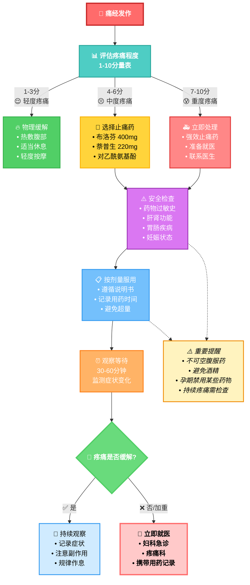

# 痛经应急药物携带完全指南：随时随地缓解疼痛的专业方案

## 引言

痛经是许多女性在经期面临的常见问题，严重时甚至会影响日常生活和工作。为了帮助你在关键时刻快速缓解疼痛，本指南将详细介绍非处方药物选择、携带合规指南、紧急用药决策流程，以及安全使用注意事项。无论你是在学校、工作场所，还是旅行途中，这份指南都能帮助你做好充分准备。

> 💡 **基础准备**：如果您是初次接触痛经用药，建议先阅读我们的[痛经安全用药全指南](/zh/downloads/medication-guide)，了解基础的用药知识和安全注意事项。

## 1. 非处方药物选择指南

### 1.1 布洛芬类药物

**作用原理**：
布洛芬（Ibuprofen）是一种非甾体抗炎药（NSAIDs），通过抑制前列腺素的合成来减轻疼痛和炎症。根据Mayo Clinic的研究，布洛芬对92%的痛经患者有效。

> 📚 **深入了解**：关于布洛芬的详细使用方法、剂量对比和安全指南，请参阅[痛经安全用药全指南](/zh/downloads/medication-guide)中的专业对比表格。

**适用人群**：
- 中度至重度痛经
- 伴随炎症（如子宫内膜异位症引起的疼痛）

**推荐剂量**：
- 成人：200-400mg，每4-6小时一次，每日不超过1200mg（具体以药品说明为准）
- 青少年（12岁以上）：按体重计算，通常5-10mg/kg，每6-8小时一次

**注意事项**：
- 避免空腹服用，以减少胃部不适
- 禁忌症：胃溃疡、肾功能不全、哮喘患者慎用

**常见品牌**：
- 美林（Motrin）
- 芬必得（Fenbid）

### 1.2 对乙酰氨基酚类药物

**作用原理**：
对乙酰氨基酚（Acetaminophen，如泰诺）主要通过抑制中枢神经系统中的疼痛信号来缓解痛经，但不具备抗炎作用。

**适用人群**：
- 轻度至中度痛经
- 对NSAIDs过敏者

**推荐剂量**：
- 成人：500-1000mg，每4-6小时一次，每日不超过4000mg
- 青少年：按体重计算，通常10-15mg/kg，每4-6小时一次

**注意事项**：
- 过量可能导致肝损伤，避免与酒精同服
- 不适合长期使用

**常见品牌**：
- 泰诺（Tylenol）
- 必理通（Panadol）

### 1.3 萘普生类药物

**作用原理**：
萘普生（Naproxen）是另一种NSAIDs，作用时间比布洛芬更长，通常可持续8-12小时。

**适用人群**：
- 需要长效缓解的痛经患者
- 夜间痛经严重者

**推荐剂量**：
- 成人：220mg，每8-12小时一次，每日不超过660mg
- 青少年：按医生指导使用

**注意事项**：
- 与布洛芬相似的禁忌症
- 起效较慢，但持续时间长

**常见品牌**：
- 萘普生钠（Aleve）

### 1.4 复合制剂

**常见组合**：
- 对乙酰氨基酚 + 咖啡因
- 布洛芬 + 咖啡因

**优势**：
- 咖啡因可增强止痛效果
- 适合伴有疲劳的痛经患者

**注意事项**：
- 避免晚间服用含咖啡因的药物
- 注意咖啡因摄入总量

## 2. 携带合规指南

### 2.1 学校携带规定

**中学阶段**：
- 多数学校允许学生携带非处方止痛药
- 建议将药物存放在原包装中，标明姓名
- 部分学校要求家长签署同意书

**大学阶段**：
- 通常无特殊限制
- 宿舍可常备应急药物
- 建议告知室友药物位置，以备紧急情况

### 2.2 工作场所携带

**办公室环境**：
- 可在个人抽屉或包中携带
- 建议准备小药盒，方便携带
- 注意药物保存条件（避光、干燥）

**特殊工作环境**：
- 医疗机构：遵循机构药物管理规定
- 食品行业：确保药物与食品分开存放
- 教育行业：了解学校对教职工用药的相关规定

### 2.3 旅行携带指南

**国内旅行**：
- 携带原包装药物
- 准备药品清单，包含通用名和商品名
- 考虑时差对用药时间的影响

**国际旅行**：
- 了解目的地国家的药物入境规定
- 准备英文药品说明或医生证明
- 考虑携带足够的药物量，避免在国外购买困难

**飞行携带**：
- 随身携带应急药物，不要托运
- 液体药物需符合航空安全规定
- 准备医生处方或药品说明，以备安检查验

## 3. 紧急用药决策流程

### 3.1 疼痛评估

**疼痛等级评分（1-10分）**：
- 1-3分：轻度疼痛，可考虑非药物缓解方法
- 4-6分：中度疼痛，建议使用止痛药
- 7-10分：重度疼痛，立即使用止痛药并考虑就医

### 3.2 用药选择决策树

**决策树使用说明**：
- **绿色路径**：轻度疼痛（1-3分），优先使用非药物方法
- **黄色路径**：中度疼痛（4-6分），选择合适的止痛药物
- **红色路径**：重度疼痛（7-10分），立即用药并考虑就医
- **紫色节点**：安全检查，确保用药安全
- **蓝色节点**：用药执行和观察阶段
- **虚线连接**：重要安全提醒，贯穿整个用药过程

### 3.3 特殊情况处理

**首次使用新药物**：
- 从最小有效剂量开始
- 观察30分钟，注意过敏反应
- 记录用药效果和副作用

**药物无效时**：
- 不要立即加大剂量
- 考虑换用不同类型的止痛药
- 如持续无效，及时就医

**出现副作用时**：
- 立即停止用药
- 记录副作用症状
- 必要时寻求医疗帮助

## 4. 安全使用注意事项

### 4.1 用药禁忌

**绝对禁忌**：
- 对药物成分过敏
- 严重肝肾功能不全
- 活动性胃肠道出血

**相对禁忌**：
- 轻度肝肾功能异常
- 哮喘病史
- 正在服用抗凝药物

### 4.2 药物相互作用

**需要注意的药物组合**：
- NSAIDs + 抗凝药物：增加出血风险
- 对乙酰氨基酚 + 酒精：增加肝损伤风险
- 多种NSAIDs同时使用：增加副作用风险

### 4.3 长期使用风险

**NSAIDs长期使用风险**：
- 胃肠道损伤
- 肾功能损害
- 心血管风险增加

**预防措施**：
- 使用最小有效剂量
- 尽量缩短使用时间
- 定期监测肝肾功能

## 5. 应急药包配置建议

### 5.1 基础配置

**必备药物**：
- 布洛芬 200mg × 10片
- 对乙酰氨基酚 500mg × 10片

**辅助用品**：
- 小型保温袋（用于热敷）
- 药物使用记录卡
- 紧急联系人信息

### 5.2 进阶配置

**额外药物**：
- 萘普生 220mg × 6片（长效选择）
- 复合制剂（含咖啡因）× 6片

**便携用品**：
- 小型药盒
- 一次性热敷贴
- 电解质补充剂

### 5.3 特殊需求配置

**旅行专用**：
- 多种剂型（片剂、胶囊、口服液）
- 英文药品说明
- 医生证明信

**工作专用**：
- 快速起效制剂
- 无嗜睡副作用药物
- 便携包装

## 6. 用药记录与监测

### 6.1 记录内容

**基本信息**：
- 用药时间和日期
- 药物名称和剂量
- 疼痛程度（用药前后）
- 副作用情况

**效果评估**：
- 起效时间
- 持续时间
- 缓解程度
- 整体满意度

### 6.2 监测指标

**短期监测**：
- 疼痛缓解效果
- 副作用发生情况
- 用药频率

**长期监测**：
- 用药依赖性
- 耐药性发展
- 整体健康状况

## 7. 紧急情况处理

### 7.1 药物过敏反应

**轻度过敏症状**：
- 皮疹、瘙痒
- 轻微恶心

**处理方法**：
- 立即停药
- 清洗接触部位
- 观察症状变化

**重度过敏症状**：
- 呼吸困难
- 面部肿胀
- 血压下降

**处理方法**：
- 立即停药
- 拨打急救电话
- 保持呼吸道通畅

### 7.2 药物过量

**症状识别**：
- 恶心、呕吐
- 腹痛
- 意识模糊

**处理步骤**：
1. 立即停止用药
2. 记录用药情况
3. 联系医疗机构
4. 保留药物包装

## 8. 替代和补充方案

### 8.1 非药物缓解方法

**物理疗法**：
- 热敷（腹部、腰部）
- 轻度运动（散步、瑜伽）
- 按摩

**生活方式调整**：
- 充足休息
- 均衡饮食
- 压力管理

### 8.2 天然补充剂

**常用选择**：
- 镁补充剂
- 维生素B6
- 鱼油

**注意事项**：
- 与药物可能存在相互作用
- 效果因人而异
- 建议咨询医生

## 相关阅读推荐

在掌握了应急药物携带的基本知识后，您可能还想了解：

### 🔗 深度学习资源

- **[痛经安全用药全指南](/zh/downloads/medication-guide)**  
  深入了解NSAIDs的作用机制、详细的药物对比表格，以及专业的用药安全指导

- **[药物vs自然疗法：哪种痛经缓解方法最适合你？](/zh/articles/medication-vs-natural-remedies-menstrual-pain)**  
  全面对比药物治疗与自然疗法的优缺点，帮助您找到最适合的个性化治疗方案

## 结论

合理的痛经应急药物携带和使用策略可以显著改善女性的生活质量。通过了解不同药物的特点、掌握正确的使用方法、做好充分的准备工作，我们可以在痛经发作时快速有效地缓解疼痛。

**关键要点**：
1. **选择合适的药物** - 根据疼痛程度和个人情况选择
2. **遵循安全用药原则** - 注意剂量、禁忌和相互作用
3. **做好携带准备** - 了解各种场合的携带要求
4. **建立应急预案** - 制定清晰的用药决策流程
5. **记录和监测** - 跟踪用药效果和副作用

记住，药物治疗只是痛经管理的一部分。如果痛经严重或模式发生变化，应及时就医寻求专业帮助。

## 参考文献

1. [Mayo Clinic - Menstrual Cramps](https://www.mayoclinic.org/diseases-conditions/menstrual-cramps)
2. [American College of Obstetricians and Gynecologists](https://www.acog.org/)
3. [FDA - Over-the-Counter Pain Relievers](https://www.fda.gov/drugs/information-consumers-and-patients-drugs)
4. [World Health Organization - Pain Management](https://www.who.int/medicines/areas/quality_safety/guide_on_pain/en/)
